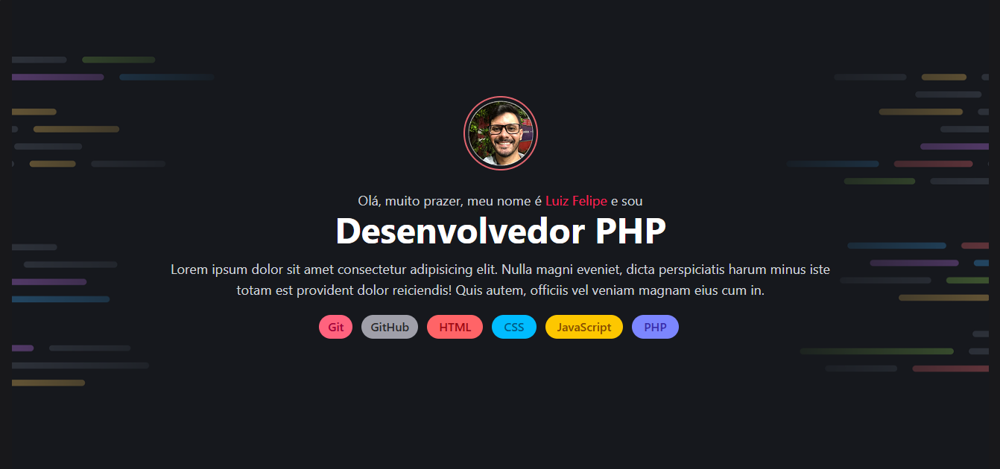

# Portfólio

Bem-vindo(a) ao Portfólio Dev! 👋

Portfólio Dev tem como objetivo compartilhar meus projetos e minha evolução na stack PHP, todos os projetos podem ser de origem pessoal como de colaboração e profissional(cliente). Este projeto é uma evolução do "Meu Portfólio".

## 🛠 Tecnologias e Ferramentas Utilizadas

- **Linguagens**: PHP, JavaScript
- **Frameworks**: Tailwindcss
- **Outras ferramentas**: Git

## 📂 Estrutura do Projeto

- `index.php`: Página inicial

## 🚀 Recursos do Portfólio

- Apresentação dos meus projetos mais recentes
- Status do projeto se está finalizado ou em desenvolvimento
- Informações sobre mim e minha jornada como desenvolvedor

## 📧 Entre em contato

Se você tiver interesse em meu trabalho ou quiser trocar uma ideia, pode entrar em contato, meu e-mail: **luizfspintoo@gmail.com**.

---

💡 *Gostou? Deixe seu feedback para que eu possa continuar melhorando!*
